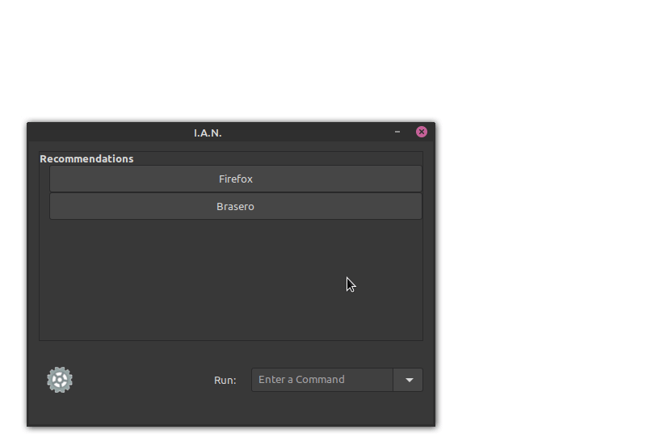
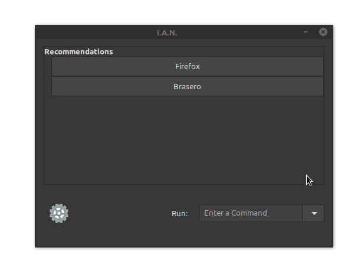
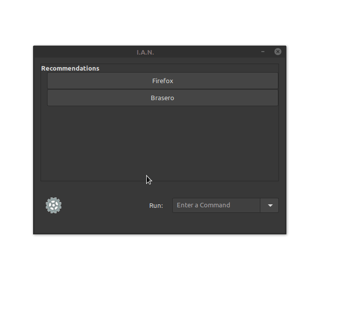

# Project I.A.N.

A Linux application selector that aims to "predict" which program you're most likely to use next. Using sets to track which hour you open each program, the selector will show you the set of programs that you are most likely to open.

## Features

### Recommendations

You can launch any of the recommended programs by clicking its button. If the program you wish to launch does not appear in the list, you can select it from the drop down menu.

### Commands

If you prefer to enter a command to launch your program, you can simply enter it into the box!

### Settings

There are plenty of settings that you can use to adjust the interface and its behaviours.

This was my A-Level Computing project and hasn't been improved since 2018.